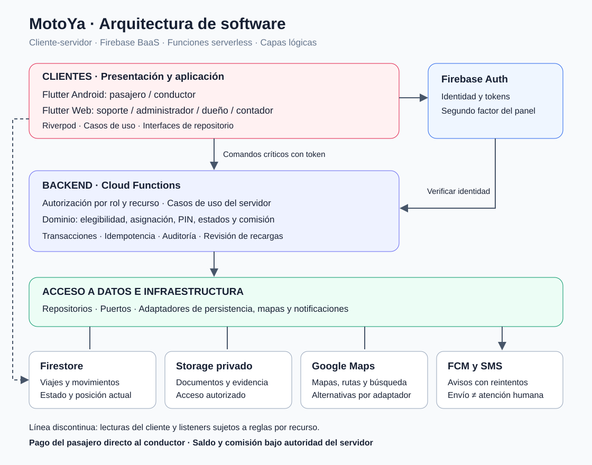
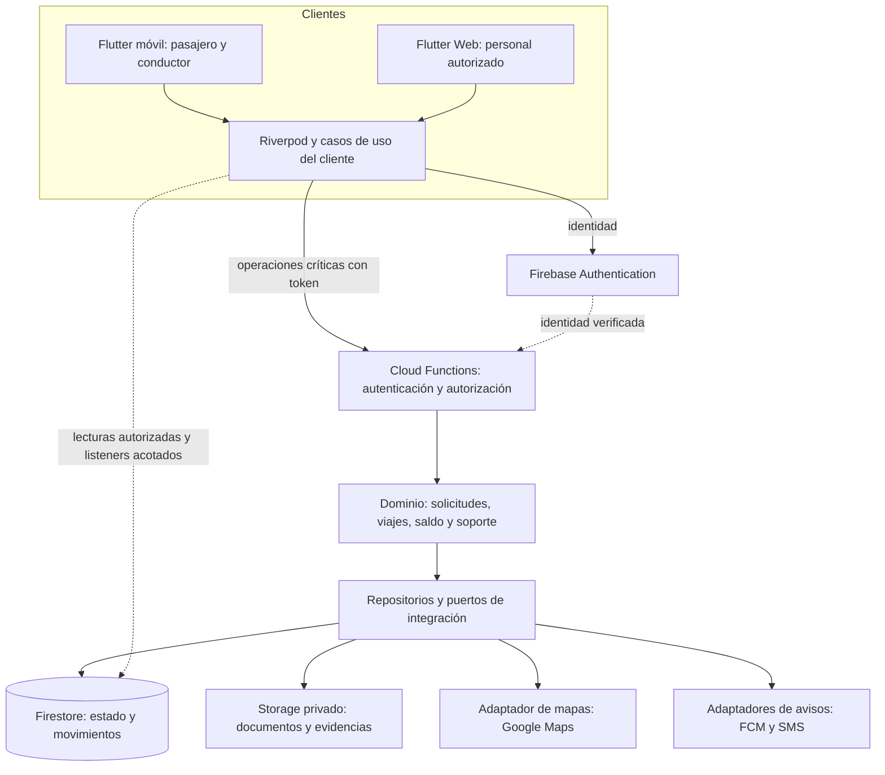
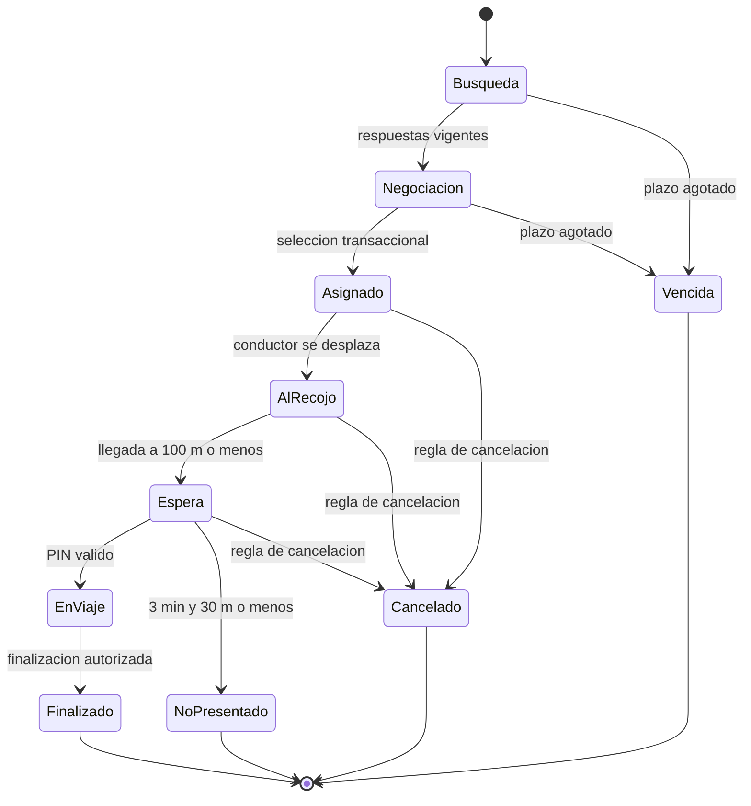

# Arquitectura inicial de MotoYa

## Estilo y alcance

Se propone **cliente-servidor con Backend como Servicio y funciones serverless**, usando Flutter, Firebase y Google Maps Platform. Dentro del cliente y del backend se separan presentación, aplicación, dominio, acceso a datos e infraestructura. Los proveedores se conectan mediante puertos y adaptadores.

Esta entrega documenta el diseño; no contiene una aplicación ejecutable ni servicios desplegados. No traslada al caso MotoYa las reglas de compra, stock o pasarelas del marketplace de referencia.

## Vista general

La imagen resume los despliegues y comunicaciones. El siguiente Mermaid permite editar las relaciones y se visualiza en GitHub.

Las flechas representan solicitudes o dependencias de ejecución; las respuestas se omiten. Los adaptadores implementan contratos definidos hacia el dominio, aunque el flujo de ejecución llegue hasta el proveedor. Las lecturas directas del SDK están sujetas a reglas y no conceden escritura sobre saldo, aprobación o asignación.

## Responsabilidades por capa

| Capa lógica | Componentes y responsabilidad | Regla de dependencia |
|---|---|---|
| Presentación | Pantallas Flutter y panel; mapas, formularios, ofertas y estados. | Invoca controladores; no decide tarifa, saldo o aprobación. |
| Aplicación | Riverpod y casos de uso; coordina interacción, comandos y resultados. Backend coordina casos críticos. | Depende de contratos del dominio y repositorios, no del SDK concreto. |
| Dominio | Elegibilidad, tarifa, asignación, PIN, estados, espera y comisión. Validación autoritativa en Functions. | No depende de widgets ni confía en importes recibidos del cliente. |
| Acceso a datos | Interfaces y repositorios de usuarios, solicitudes, viajes, saldo y documentos. | Encapsula persistencia, transacciones y transformación de datos. |
| Infraestructura e integración | Adaptadores Firebase, mapas, FCM y SMS; Firestore y Storage. | Implementa contratos; el proveedor no define reglas de negocio. |

La UI y su estado residen en los clientes. Una validación local mejora la experiencia, pero el backend repite la comprobación de toda operación sensible. Las cinco capas son responsabilidades lógicas, no cinco servidores.

## Módulos y trazabilidad

| Módulo | Responsabilidad | Requisitos | Drivers |
|---|---|---|---|
| Identidad y conductores | Celular, perfiles, documentos, aprobación y roles. | RF-01, RF-02, RF-13 | DA-03, DA-08 |
| Solicitudes y negociación | Ruta, tarifa, elegibilidad, oferta, vencimiento y asignación. | RF-03 a RF-06 | DA-01, DA-02 |
| Viajes y ubicación | Estados, llegada, espera, PIN, recorrido y finalización. | RF-07, RF-08, RF-10 | DA-01, DA-05, DA-07 |
| Comunicación y seguridad del viaje | Chat, contactos, datos compartibles y SOS. | RF-09 | DA-03, DA-08 |
| Saldo y recargas | Movimientos, comprobación de abono y comisión idempotente. | RF-10, RF-11 | DA-04 |
| Reputación y soporte | Reseñas, reclamos, sanciones, atención y reportes. | RF-12 a RF-14 | DA-03, DA-08 |

## Modelo de datos propuesto

Los nombres de colecciones son una propuesta de implementación, no un esquema impuesto por el PDF.

| Colección o agregado | Información e invariantes |
|---|---|
| usuarios / conductores | Identidad común, perfil, revisión, disponibilidad y referencia a viaje activo; un usuario no se concede roles privilegiados. |
| motos / documentos | Propiedad, moto, metadatos y referencia privada a Storage. |
| solicitudes / ofertas | Pasajero, origen, destino, ruta, distancia, precio, versión, vencimiento y selección única. |
| viajes | Participantes, solicitud, distancia planeada, precio acordado, estado, tiempos y configuración aplicada. |
| ubicacionesActuales / recorridos | Posición con fecha y viaje; historial separado y acceso por propósito. |
| movimientos / saldos | Importe en céntimos, tipo, origen, actor, fecha y referencia; saldo materializado actualizado con cada movimiento. |
| recargas / referenciasRecarga | Evidencia, monto, estado de revisión y referencia externa única. |
| mensajes / resenas / reclamos / alertas | Relación con viaje, autor, acceso, seguimiento y retención por categoría. |
| auditoria / tareasAviso | Cambios sensibles y avisos pendientes con resultado y reintentos. |

El libro de movimientos es la fuente de trazabilidad financiera. Un saldo materializado debe coincidir con sus movimientos y actualizarse en la misma transacción. PIN, documentos y mensajes completos no se incluyen en logs técnicos.

## Flujo de solicitud y asignación

1. El pasajero selecciona origen y destino. Functions valida cobertura, obtiene ruta por el adaptador y calcula referencia: máximo entre S/ 3.00 y S/ 2.14 por km.
2. El backend registra la solicitud y busca conductores aprobados, conectados, libres y con saldo suficiente. Radio inicial 1.5 km, luego 2.5 km y 3 km.
3. Cada respuesta conserva importe, versión y vencimiento. El reloj del servidor decide si sigue vigente.
4. Al seleccionar oferta, una transacción lee solicitud, oferta, conductor y controles financieros necesarios. Revalida estado, versión, vencimiento, disponibilidad y saldo.
5. Confirma viaje, asignación única y bloqueo del conductor. Las ofertas competidoras quedan lógicamente cerradas por el estado de la solicitud; una limpieza posterior puede actualizar sus documentos sin abrir otra asignación.
6. Solo después de persistir se envían avisos. El push comunica el resultado y no reemplaza su confirmación.

Para proteger saldo suficiente hasta finalizar se propone una reserva de comisión al asignar: no es un descuento y se libera al cancelar. Debe validarse como detalle de implementación; el PDF exige elegibilidad por saldo y descuento al finalizar, pero no define el mecanismo de reserva.

Las llamadas de mapas y avisos se realizan fuera de la transacción. Una función transaccional puede repetirse y no debe disparar efectos externos en cada intento.

## Ciclo de vida

Búsqueda y negociación corresponden a la solicitud; los estados posteriores pertenecen al viaje. Cada transición valida actor, estado anterior, tiempo y evidencia. La política concreta de cancelación durante un recorrido debe especificarse antes de implementarla.

Llegada: máximo 100 m. Espera: cinco minutos gratuitos y luego S/ 0.50 por minuto. No presentación: desde tres minutos y máximo 30 m; es una condición distinta del recargo. Inicio: PIN de cuatro dígitos y aviso a soporte tras tres fallos.

## Finalización y recarga sin duplicados

**Finalizar:** una transacción verifica participante y estado, consulta el movimiento estable `comision:{viajeId}`, calcula S/ 0.333 por km planeado con precisión intermedia y redondeo final, registra movimiento, actualiza saldo y libera conductor. Si ya finalizó, devuelve el resultado conservado. Durante promoción puede descontar cero conservando la comisión teórica. Cancelar no genera ese movimiento.

**Aprobar recarga:** soporte comprueba el abono real. Una transacción verifica rol, estado pendiente y referencia externa normalizada; registra referencia, movimiento estable, saldo y auditoría. La referencia debe identificar inequívocamente la operación y su proveedor/cuenta receptora. Otra solicitud no puede reutilizarla.

**Avisos:** registrar una tarea persistente junto al resultado permite reintentar si FCM o SMS falla. Los estados de aviso se mantienen separados del estado del viaje y de la atención humana.

## Seguridad y privacidad

- Denegación por defecto; autorización por identidad, rol y relación con cada recurso.
- Las funciones con acceso administrativo a Firebase verifican permisos explícitamente: no dependen de las reglas del cliente para proteger sus propias escrituras.
- El panel exige cuentas diferenciadas, segundo factor, cierre por inactividad y auditoría.
- Documentos privados y acceso temporal autorizado; secretos del servidor fuera de la app.
- GPS: verificar proximidad y coherencia, considerando errores de señal; detectar simulación no garantiza autenticidad.
- Retención: chat 90 días, recorrido 12 meses y auditoría dos años.

## Despliegue, continuidad y consumo

App Android en dispositivos; panel Flutter Web en alojamiento web; backend y datos en servicios administrados. Pruebas y producción utilizan proyectos distintos. GraphHopper y Photon son alternativas propuestas que requieren infraestructura y evaluación.

Ante pérdida de red, mostrar estado pendiente o desactualizado. Al reconectar, recuperar el viaje autoritativo; una oferta vencida no vuelve a ser válida por sincronización. No confirmar asignación, inicio, finalización o recarga únicamente desde caché local.

Limitar suscripciones a datos necesarios; separar posición actual de historial; medir índices, escrituras y lecturas. A cinco segundos, 300 viajes producen unas 60 actualizaciones de posición por segundo, antes de otros consumos. La frecuencia de 3–5 s procede del PDF y no se presenta como una medición real.

## Decisiones, riesgos y validación

| Decisión | Drivers | Riesgo o prueba necesaria |
|---|---|---|
| Backend con autoridad y transacciones | DA-01, DA-04 | Competencia por solicitud/conductor; reintentos de finalización y recarga. |
| Firestore y FCM con consultas acotadas | DA-02, DA-07 | Ofertas vencidas, retraso de avisos, GPS antiguo y costo bajo carga. |
| Auth, permisos por recurso y Storage privado | DA-03 | Lecturas ajenas, escalamiento de roles y accesos documentales. |
| Estado persistido y reconciliación | DA-05 | Cortar red antes/después del commit y comprobar recuperación. |
| Puertos y adaptadores | DA-06 | Sustituir mapas o persistencia sin rehacer pantallas. |
| Panel y protocolo SOS | DA-08 | Alerta creada pero no atendida; asignación, seguimiento y cierre humano. |

Pruebas funcionales: registro, aprobación, negociación, radios, llegada, espera, PIN, calificación y finalización. Pruebas de integridad: una asignación, un viaje activo por conductor y un movimiento por origen. Pruebas de seguridad con roles distintos, continuidad con cortes y carga progresiva hasta las metas de 2,000 conductores y 300 viajes simultáneos.

Disponibilidad objetivo 99.5 %. Copias diarias, retención 30 días y restauración mensual comprobando viajes y movimientos. No se afirma que estas metas estén implementadas o alcanzadas.

## Pendientes antes de implementación

Definir cinco distritos de cobertura, límites de negociación, vigencia de ofertas, fracciones de minuto, redondeo financiero, cancelación durante recorrido, saldo disponible/reservado y responsabilidades de atención de SOS.

**Fuente principal:** ENTREGABLE-02_MotoYa.pdf, 1 de octubre de 2026. La organización documental toma como referencia el repositorio Marketplace-arquitSoft-02-alvaro; las reglas del negocio corresponden a MotoYa.

[← Drivers](../analisis-de-sistema/06-driver-arquitectonicos.md) · [Inicio](../README.md)
